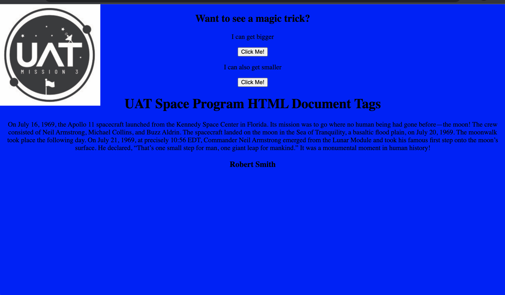

The objectives of this task are to understand and code a working HTML page, understand the requirements, translate the requirements into an HTML page, and use HTML 5.0 tags. The guidelines and expectations are to use the image provided and code the following: Doctype, HTML tags, Head tags, Title tags, Title text, Body tags, Header tags, Header text, Paragraph tags, and add an alert (any kind of your choice).

# REQUIREMENTS

 >👨🏿‍⚖️ Click name to downlaod

[Visual Code](https://code.visualstudio.com/download)

# INSTALLATION

>👨🏿‍⚖️ INSTALL ZIP FILE OR CLONE REPO

[click here](https://github.com/brprod8/Program-HTML-Document-Tags/archive/refs/heads/main.zip) for zip file

[click here](https://github.com/brprod8/Program-HTML-Document-Tags) to clone repo

# LICENSE
**Open to Experiment**

BY:ROBERT SMITH

CREDIT: University of Advancing Tech

EMAIL - Buildingreality@skiff.com for Colloboration 
